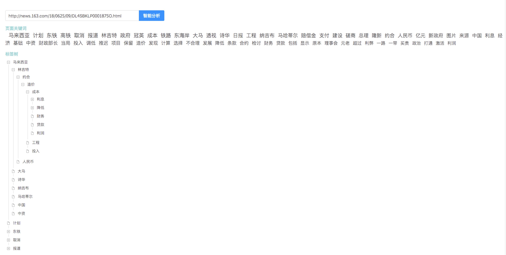

# tgenerator

Taxonomy Generator
智能标签生成器是由微苗科技开发的通过机器学习可识别文本、图片并自动生成标签的人工智能应用

## Features

- 前后台分离
- 前台react开发，组件化，高效
- 后台Python开发，提供独立可运行接口
- 爬虫解析网页链接
- 中文语言处理，分词，词向量化
- 图片识别处理
- 标签体系的智能生成算法

## Requrements

- Python (>=3.5)

pip3 install -r requirement.txt

## Usage

### * web ui

1. go to TaxonomyBE directory

2. start web service

    `#python3 startapp.py`

3. open your browser, and enter http://localhost:8089

4. enter the url you want to analysis

5. get result like below

## Email
ken@wemiam.com

